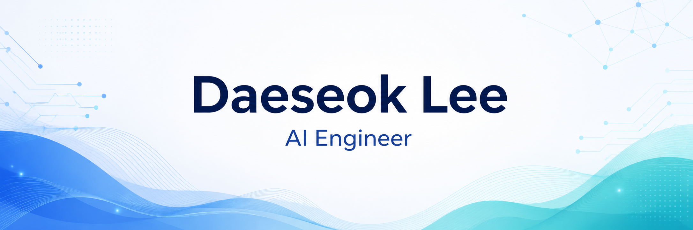

## ✨ EXPERIENCES

- ⚡ 코드잇 AI 엔지니어 부트캠프 2기 | 2025
- 💼 (주)마크클라우드 AI-Engineer Intern | 2026.03 ~ Present

## 🎯 Projects

### 2026

- [마케팅 콘텐츠 자동화] | 마크클라우드 인턴
  - 네이버 블로그 포스팅 및 카드뉴스 생성 자동화 파이프라인 개발

- [정부 R&D 사업계획서] | 마크클라우드 인턴
  - 정부지원사업 사업계획서 4건 작성 참여
  - 수요기업 미팅, 과제 기획, 사업계획서 작성 수행
    
### 2025

- [알약 이미지 객체 탐지 프로젝트] | 코드잇 AI 부트캠프
  - YOLOv8/v11 기반 경구약제 객체 탐지 및 클래스 불균형 개선

- [RAG 기반 제안요청서 요약 챗봇] | 코드잇 AI 부트캠프
  - PDF 문서 파싱, 청킹, 검색 기반 요약 챗봇 구현

- [카페 로그/광고 생성 서비스] | 코드잇 AI 부트캠프
  - 사용자 입력 기반 카페 로고 생성 및 광고 콘텐츠 생성 서비스 구현

- [흉부 X-ray 폐렴 분류] | 코드잇 AI 부트캠프
  - ResNet18, ResNet50 전이학습 및 fine-tuning 비교 실험
